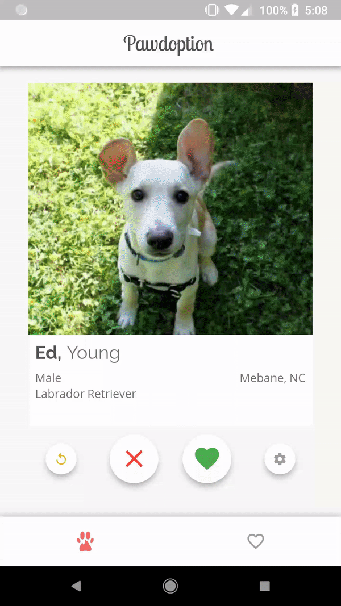
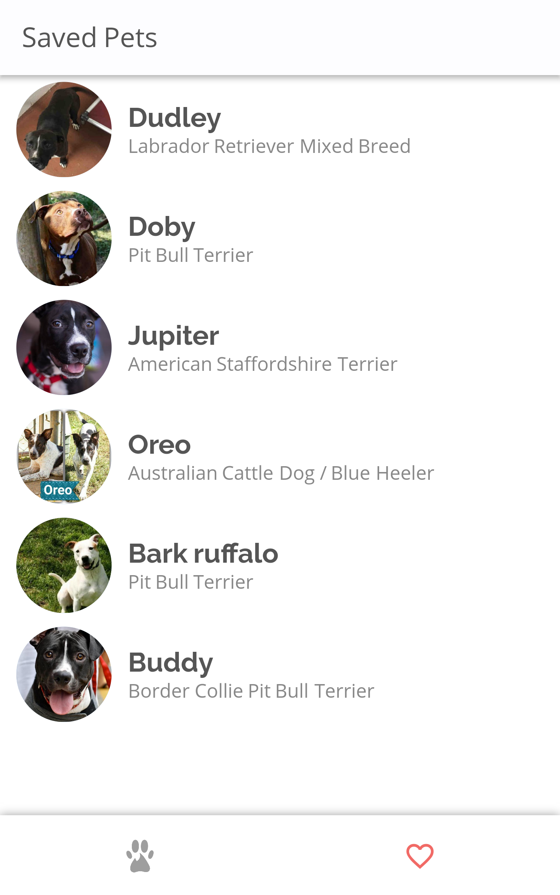

# Pawdoption

This app helps you find your next pet from local animal shelters!
Swipe through pets in a Tinder like interface to search for your next pet.
Swipring right will save the pet to your saved list for later viewing.

All pets have information such as age, breed, biograph and which shelter
they are located in! It gives you the contact and general information 
necessary to adopt the pet.

Pawdoption allows you to choose between swiping through dogs or cats.
(Option for both coming soon!)

## Get it for Android

Pawdoption is currently live on the Google Play Store!

## Get it on iOS

**Coming soon!**

# Development details

## The Pet API

All pet information was gathered through the [PetFinder](http://www.petfinder.com) API. 

I initially protyped this application by getting pet information from PetHarbor. I would
just generate the queries I needed and then scrape the page to get the information I needed.
PetHarbor doesn't have an API and I know scraping a website is generally frowned upon especially for
production apps so I emailed PetHarbor asking if it was okay if I did.

They said no.

So I ended up finding PetFinder and it saved the application! Luckily, PetFinder had everything I needed
and basically the same pets as PetHarbor so the app stayed the same, just the working's under the hood
changed. The only downside is that the API only allows 10k requests a day, anymore requests and you have to 
ask for special permission from PetFinder to go above that. I suspect you have to start paying at that
point. 

So if this app ever gets to around 10k users I'm going to have to find a way to make some money off
it. But that's a good problem to have at that point I guess!

## What's this made with?

Flutter!

Google's new mobile app SDK allows you to build for both iOS and Android using one code base! I thought
it was pretty cool so I decided to try it out with this app. So far it was a good experience! 

Dart is a cool language without much to not like about it. However, it is kind of "boring" in that
there is nothing especially cool about it either. It has everything you'd expect a language to have,
and the syntax is very similar to Java and Javascript. 
Overall it is just a really nice language to code in and I do hope to see it grow to something big.

Flutter was really great to work with. Hot reload allowed me to really style the app very quickly
and the design of the framework really makes it easy to build what you want. I definitely
think I'll make some more apps with this. 

## That was a long answer

I'm debating on writing a longer post about this app and developing it because Flutter is still new
plus it was really fun making this app. So that was just a little practice doing that kind of writing.

