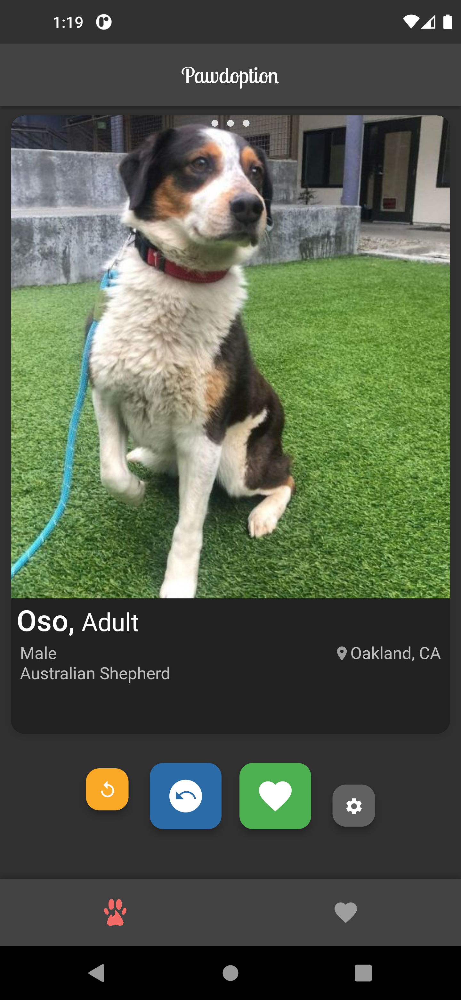
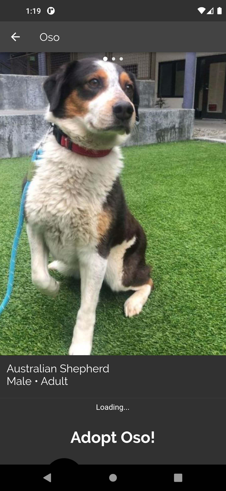

# Pawdoption

This app helps you find your next pet from local animal shelters!
Built with Flutter and uses a swiping interface to search through pets
from local shelters.

All pets have information such as age, breed, and which shelter
they are located in! It gives you the contact and general information 
necessary to adopt the pet.

## Get it for Android

Pawdoption is currently live on the Google Play Store!

## Get it on iOS

**Coming soon!**

## The Pet API

All pet information was gathered through the [PetFinder](http://www.petfinder.com) API. 
